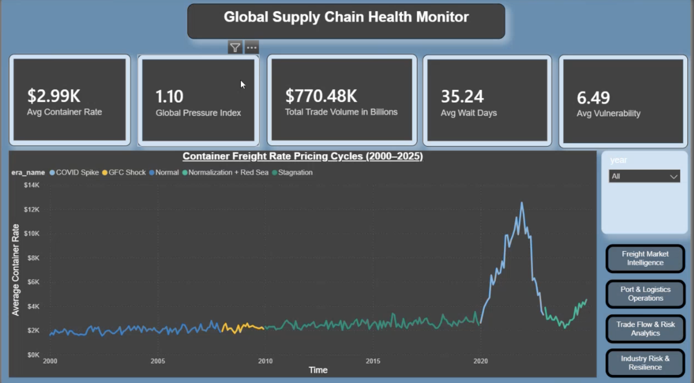
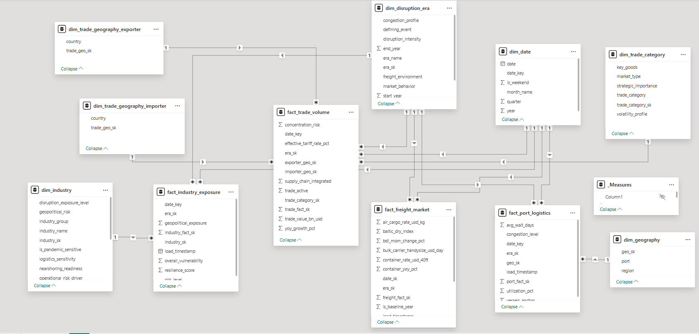

# Global Supply Chain & Trade Disruption Analytics Platform

An end-to-end analytics engineering and business intelligence platform designed to analyze global supply chain disruptions, freight market volatility, geopolitical trade exposure, and industry vulnerability using dimensional modeling, Python preprocessing, Talend ETL pipelines, and Power BI executive dashboards.

---

# Global Supply Chain & Trade Disruption Analytics Platform


# Dashboard Preview



The Executive Overview dashboard provides centralized operational visibility across:
- freight market volatility,
- supply chain pressure,
- port congestion,
- trade activity,
- and industry vulnerability.

---

# Dimensional Warehouse Model



The dimensional warehouse follows Kimball modeling principles using:
- conformed dimensions,
- surrogate keys,
- star schema architecture,
- and centralized semantic KPI modeling.

---

# Talend ETL Workflow


Talend ETL pipelines were implemented for:
- dimensional loading,
- surrogate key generation,
- business enrichment,
- and warehouse integration.

---

# Exploratory Data Analysis


EDA was performed to:
- analyze freight volatility,
- identify congestion patterns,
- detect operational anomalies,
- and validate analytical trends across disruption periods.

---

An end-to-end analytics engineering and business intelligence platform designed to analyze global supply chain disruptions...

# Project Overview

This project implements a complete analytics engineering workflow for global supply chain intelligence.

The platform integrates:

- freight market analytics,
- maritime congestion monitoring,
- geopolitical trade analysis,
- and industry vulnerability assessment

into a centralized dimensional warehouse and executive reporting environment.

The final solution combines:

- exploratory data analysis,
- data quality engineering,
- feature engineering,
- dimensional warehousing,
- ETL orchestration,
- semantic KPI modeling,
- and executive analytical storytelling.

---

# Business Problem

Global supply chains experienced severe disruption due to:

- COVID-19 pandemic,
- freight inflation,
- port congestion,
- geopolitical instability,
- and international trade disruptions.

Organizations often lack integrated analytical visibility across:

- logistics operations,
- freight markets,
- trade relationships,
- and strategic industry exposure.

This project addresses these challenges by building a centralized executive analytics platform capable of monitoring operational disruptions and strategic supply chain risk.

---

# Project Objectives

- Build analytical dimensional warehouse
- Integrate multiple operational datasets
- Perform EDA and preprocessing
- Develop Talend ETL pipelines
- Apply Kimball dimensional modeling
- Create executive Power BI dashboards
- Enable disruption-era storytelling analytics
- Support operational and strategic decision-making

---

# Technology Stack

| Technology         | Purpose                             |
| ------------------ | ----------------------------------- |
| Python             | preprocessing & feature engineering |
| Pandas             | data transformation                 |
| Talend Open Studio | ETL orchestration                   |
| Power BI           | dashboards & analytics              |
| Kimball Modeling   | warehouse architecture              |
| CSV Datasets       | operational data sources            |

---

# Dataset Overview

| Dataset           | Description                                                                  |
| ----------------- | ---------------------------------------------------------------------------- |
| Shipping Rates    | Freight market indicators, container pricing, and logistics pressure metrics |
| Port Congestion   | Maritime operational congestion, vessel backlog, and utilization metrics     |
| Trade Flows       | Bilateral international trade analytics and geopolitical exposure            |
| Industry Exposure | Industry vulnerability, resilience, and operational risk indicators          |
| Disruption Events | Historical disruption segmentation for analytical storytelling               |

---

# Architecture Overview

```text
Raw Datasets
        ↓
EDA & Data Profiling
        ↓
Python Preprocessing & Enrichment
        ↓
Talend ETL Pipelines
        ↓
Dimensional Warehouse
        ↓
Power BI Semantic Layer
        ↓
Executive Dashboards
```

---

# Data Engineering Workflow

The project follows a complete analytics engineering lifecycle:

1. Exploratory Data Analysis (EDA)
2. Data Cleaning & Standardization
3. Feature Engineering
4. Dimensional Modeling
5. Talend ETL Development
6. Warehouse Integration
7. Semantic KPI Engineering
8. Power BI Dashboard Development

---

# Exploratory Data Analysis (EDA)

EDA was performed to:

- understand operational patterns,
- identify anomalies,
- detect outliers,
- analyze freight volatility,
- validate trade behavior,
- and monitor congestion trends.

## Key Findings

- Freight rates sharply increased during COVID-19
- Port congestion concentrated heavily in Asia
- Trade growth fluctuated during geopolitical disruptions
- Semiconductor and automotive industries showed highest vulnerability
- Freight market volatility strongly correlated with disruption periods

---

# Data Cleaning & Quality Engineering

Several data quality issues were identified and resolved during preprocessing.

## Data Quality Challenges

| Problem                | Solution            |
| ---------------------- | ------------------- |
| Missing values         | imputation          |
| Duplicate records      | deduplication       |
| Inconsistent naming    | standardization     |
| Invalid dates          | normalization       |
| Schema inconsistencies | datatype validation |

## Business Standardization

- Port name normalization
- Region mapping standardization
- Trade category alignment
- Consistent business semantics
- Unified geographical classification

---

# Feature Engineering & Enrichment

Raw operational data was transformed into business-oriented analytical intelligence using centralized preprocessing and ETL business logic.

## Engineered Features

| Feature                   | Purpose                         |
| ------------------------- | ------------------------------- |
| vulnerability_band        | risk segmentation               |
| resilience_level          | resilience benchmarking         |
| disruption_exposure_level | operational exposure analysis   |
| nearshoring_readiness     | strategic adaptation monitoring |
| strategic_industry_flag   | executive filtering             |

---

# Dimensional Warehouse Design

The warehouse follows Kimball dimensional modeling principles using:

- conformed dimensions,
- surrogate keys,
- star schema architecture,
- and business-oriented analytical modeling.

---

# Fact Tables

| Fact Table             | Business Process                |
| ---------------------- | ------------------------------- |
| fact_freight_market    | freight market intelligence     |
| fact_port_logistics    | port congestion monitoring      |
| fact_trade_volume      | geopolitical trade analytics    |
| fact_industry_exposure | industry vulnerability analysis |

---

# Conformed Dimensions

| Dimension          | Purpose                     |
| ------------------ | --------------------------- |
| dim_date           | time intelligence           |
| dim_geography      | regional analytics          |
| dim_industry       | strategic segmentation      |
| dim_trade_category | trade classification        |
| dim_disruption_era | disruption-era storytelling |

---

# Relationship Strategy

The semantic warehouse follows strict star schema principles.

## Design Principles Applied

- One-to-many relationships
- Single-direction filtering
- Surrogate key integration
- Fact grain enforcement
- Conformed dimensions
- Dimension-driven filtering

The architecture intentionally avoids:

- snowflake complexity,
- many-to-many ambiguity,
- and bidirectional relationship instability.

---

# Fact Table Architecture

The warehouse was designed using multiple analytical fact tables, where each fact represents a specific business process with clearly defined grain and measurable operational KPIs.

| Fact Table             | Business Process        | Grain                                       | Key Metrics                          |
| ---------------------- | ----------------------- | ------------------------------------------- | ------------------------------------ |
| fact_freight_market    | Freight Intelligence    | One row per reporting month                 | Container rates, BDI, pressure index |
| fact_port_logistics    | Port Operations         | One row per port per week                   | Congestion, wait days, utilization   |
| fact_trade_volume      | Trade Analytics         | One row per exporter-importer-category-year | Trade value, tariffs, growth         |
| fact_industry_exposure | Industry Risk Analytics | One row per industry per reporting period   | Vulnerability, resilience, exposure  |

## Engineering Principles

- Strict grain enforcement
- Additive KPI design
- Conformed dimension integration
- Surrogate key relationships
- Star schema optimization

---

# Hybrid Python + Talend ETL Architecture

During implementation, several advanced transformations were identified as inefficient for Talend-only orchestration.

A hybrid Python + Talend architecture was adopted to improve maintainability, simplify transformation logic, and optimize analytical processing.

## Engineering Challenges

| Challenge                            | Talend Limitation               | Engineering Solution       |
| ------------------------------------ | ------------------------------- | -------------------------- |
| Complex trade joins                  | Multi-role geography complexity | Python preprocessing       |
| Bilateral exporter/importer modeling | Difficult role-playing joins    | Pandas merge workflows     |
| Advanced enrichment logic            | Large tMap complexity           | Python feature engineering |
| Heavy preprocessing workflows        | Reduced maintainability         | Hybrid ETL architecture    |
| Analytical classification generation | Complex nested expressions      | Centralized preprocessing  |

---

# Hybrid Workflow

```text
Raw Datasets
      ↓
Python Preprocessing & Enrichment
      ↓
Curated Intermediate Datasets
      ↓
Talend ETL Orchestration
      ↓
Dimensional Warehouse
      ↓
Power BI Dashboards
```

---

# ETL Pipeline Architecture

Talend ETL pipelines were implemented to:

- ingest datasets,
- apply transformations,
- generate dimensions,
- create surrogate keys,
- validate data quality,
- and produce warehouse-ready outputs.

## ETL Responsibilities

- Dimensional loading
- Surrogate key generation
- Business enrichment
- Data validation
- Analytical classification
- Warehouse integration

---

# Business Logic Engineering

Business-oriented analytical classifications were centralized inside ETL pipelines rather than Power BI to improve semantic consistency, maintainability, and KPI reuse.

## Engineered Classifications

| Classification            | Business Purpose                |
| ------------------------- | ------------------------------- |
| vulnerability_band        | operational risk segmentation   |
| resilience_level          | resilience benchmarking         |
| disruption_exposure_level | disruption severity analysis    |
| nearshoring_readiness     | strategic adaptation monitoring |
| strategic_industry_flag   | executive risk filtering        |

## Engineering Benefits

- Reduced DAX complexity
- Centralized analytical logic
- Consistent KPI calculations
- Reusable business semantics
- Improved dashboard maintainability

---

# Power BI Dashboard Development

The Power BI reporting layer was designed as an executive supply chain intelligence platform focused on operational storytelling and strategic analytics.

---

# Dashboard Storytelling Flow

```text
Global Disruption
        ↓
Freight Market Stress
        ↓
Port Congestion
        ↓
Trade Flow Shifts
        ↓
Industry Vulnerability
```

---

# Dashboard Pages

| Dashboard                   | Purpose                       |
| --------------------------- | ----------------------------- |
| Executive Overview          | global operational visibility |
| Freight Market Intelligence | freight analytics             |
| Port & Logistics Operations | congestion monitoring         |
| Trade Flow & Risk Analytics | geopolitical trade analysis   |
| Industry Risk & Resilience  | vulnerability analytics       |

---

# Executive Overview Dashboard

## Key KPIs

- Avg Container Rate
- Global Pressure Index
- Avg Wait Days
- Total Trade Volume
- Avg Vulnerability

## Key Capabilities

- Freight trend analysis
- Disruption-era comparison
- Executive KPI monitoring
- Interactive filtering
- Global operational visibility

---

# Freight Market Intelligence

## Analytical Focus

- freight volatility
- Baltic Dry Index analysis
- freight inflation trends
- delivery performance tracking
- operational market monitoring

## Business Value

This layer monitors logistics market instability and transportation reliability across global disruption periods.

---

# Port & Logistics Operations

## Analytical Focus

- vessel backlog analysis
- congestion hotspot monitoring
- port operational benchmarking
- regional congestion heatmaps
- maritime logistics visibility

## Business Value

This dashboard monitors maritime operational bottlenecks and logistics congestion across major global ports.

---

# Trade Flow & Risk Analytics

## Analytical Focus

- trade growth trends
- concentration risk analysis
- bilateral trade monitoring
- geopolitical trade exposure
- trade category intelligence

## Business Value

This layer enables geopolitical trade analysis and monitors global trade dependency and concentration risk.

---

# Industry Risk & Resilience

## Analytical Focus

- vulnerability rankings
- resilience benchmarking
- geopolitical exposure analysis
- strategic risk segmentation
- industry resilience monitoring

## Business Value

This dashboard enables strategic industry risk assessment through vulnerability and resilience analytics.

---

# Centralized DAX Measure Layer

A dedicated semantic measure table was implemented to standardize KPI calculations and improve maintainability.

## Core Measures

| Measure               | Business Purpose                 |
| --------------------- | -------------------------------- |
| Avg Container Rate    | freight inflation monitoring     |
| Global Pressure Index | supply chain stress monitoring   |
| Avg Wait Days         | port congestion analysis         |
| Total Trade Volume    | global trade activity            |
| Avg Vulnerability     | industry fragility analysis      |
| Avg Resilience        | recovery benchmarking            |
| Trade Growth %        | trade performance tracking       |
| On-Time Delivery %    | logistics reliability monitoring |

---

# Visualization Design Principles

The dashboard follows enterprise BI visualization standards.

## Design Principles Applied

- minimal visual clutter,
- consistent dark executive theme,
- centralized KPI visibility,
- operational storytelling flow,
- high-contrast readability,
- and analytical clarity.

---

# Interactive Reporting Features

## Features Implemented

| Feature             | Purpose                 |
| ------------------- | ----------------------- |
| Slicers             | dynamic filtering       |
| Cross-filtering     | interactive exploration |
| KPI Cards           | executive monitoring    |
| Navigation Buttons  | dashboard usability     |
| Interactive Legends | disruption comparison   |

---

# Key Business Insights

- COVID-19 caused historic freight inflation spikes
- Port congestion sharply increased during 2020–2022
- Semiconductor and automotive sectors showed highest vulnerability
- Trade concentration risk increased during geopolitical disruptions
- Nearshoring readiness became strategically important post-COVID
- Freight market volatility strongly correlated with disruption eras

---

# Engineering Challenges & Solutions

| Challenge                       | Engineering Solution           |
| ------------------------------- | ------------------------------ |
| Overlapping disruption periods  | dim_disruption_era             |
| Many-to-many relationship risks | star schema architecture       |
| Complex trade joins             | hybrid Python + Talend ETL     |
| KPI inconsistency               | centralized ETL business logic |
| Complex analytical enrichment   | feature engineering pipelines  |

---

# Business Value Delivered

The platform enables:

- operational logistics monitoring,
- freight market intelligence,
- geopolitical trade analysis,
- strategic industry resilience assessment,
- and disruption-era storytelling.

The final solution supports:

- executive reporting,
- operational monitoring,
- strategic analytics,
- and supply chain intelligence.

---

# Folder Structure

```text
project/
│
├── data/
├── notebooks/
├── talend_jobs/
├── warehouse/
├── dashboards/
├── docs/
├── screenshots/
└── README.md
```

---

# Future Enhancements

- Real-time streaming pipelines
- Predictive analytics
- AI forecasting
- Live API integration
- Advanced supply chain simulation
- Machine learning-based disruption prediction

---

# Conclusion

This project demonstrates how analytics engineering, dimensional warehousing, ETL orchestration, semantic KPI modeling, and executive business intelligence can be integrated into one scalable analytical platform.

The final solution successfully combines:

- data engineering,
- ETL orchestration,
- dimensional warehouse architecture,
- semantic KPI modeling,
- and executive Power BI analytics

into a centralized supply chain intelligence environment supporting operational visibility, geopolitical trade monitoring, logistics analytics, and strategic industry risk assessment.
